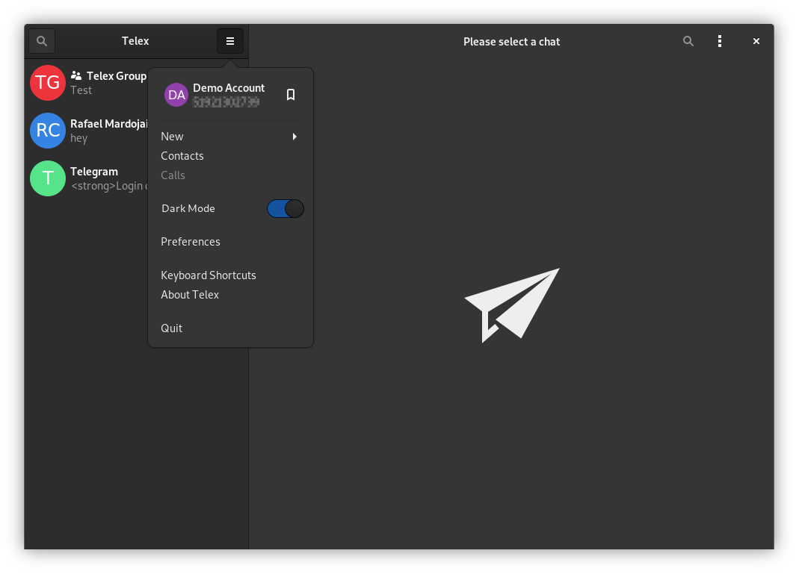

<h1 align="center">
	 
 Telex
</h1>

<strong>Proof of concept Telegram Client for GNOME</strong>

# ADVICES
THIS IS PROOF OF CONCEPT SOFTWARE FAR FROM USABLE.

PLEASE DON'T OPEN ISSUES FOR THINGS WE ALL KNOW ARE BROKEN.

THERE'S NO DECISION TO DEVELOP ACTIVELY THIS PROJECT YET.

CURRENT CODE IS SHITTY AND DIRTY.

## Installation
This app is written to be Flatpak only. The easiest way to test Telex is cloning this repo with **GNOME Builder** and run it from there.

## Running
Telex needs Telegram API ID and hash to work, currently you need to provide your own.
 
* Login to your [Telegram account](https://my.telegram.org/) with the phone number of the developer account to use.
* Click under API Development tools.
* A Create new application window will appear. Fill in your application details.
* Click on Create application at the end. Remember that your API hash is secret and Telegram won’t let you revoke it. Don’t post it anywhere!

Telex will ask for your API ID and hash in the terminal.
